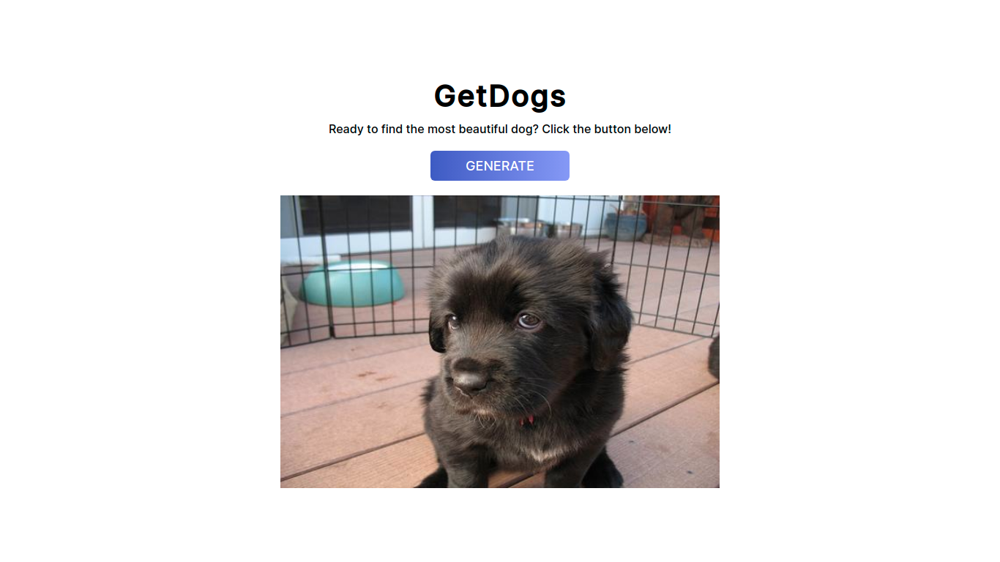

# GetDogs

Random dog images generator using the dog.ceo API.

## How to run

1. Download / Clone the repo files.
2. Go into the directory and run `npm install`
3. After installing all the packages, run `npm start` and go to `http://localhost:3000`

## About

Uses styled-components and useEffect / useState hook.

## Images

